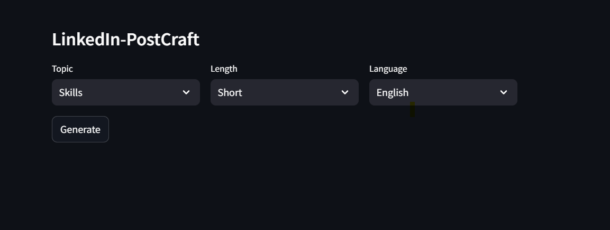

# LinkedIn-PostCraft

**LinkedIn-PostCraft** is a tool designed to analyze past LinkedIn posts of influencers and assist them in generating new content that aligns with their established writing style.

**Live at : 
---

## How It Works
1. **Analyze Past Posts**: The tool extracts key attributes such as topics, language, and length from existing posts.
2. **Generate New Posts**: Based on the selected topic, language, and length, the tool uses few-shot learning with past posts to guide the LLM in generating new content that matches the influencer's style.

---

## Technical Architecture


1. **Stage 1**: Collect LinkedIn posts and extract attributes like topic, language, and length.
2. **Stage 2**: Use the extracted attributes to generate a new post by leveraging past posts for style matching.

---

## Setup
1. Obtain an API key:
   - Visit: [Groq API Keys](https://console.groq.com/keys)
   - Add the key to your `.env` file:  
     ```
     GROQ_API_KEY=<your_api_key>
     ```
2. Install dependencies:
   ```
   pip install -r requirements.txt
   ```
3. Run the application:
   ```
   streamlit run main.py
   ```
